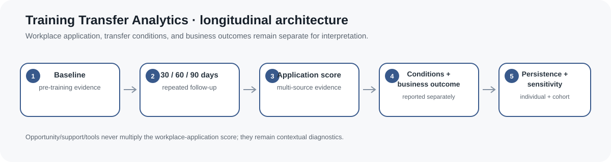
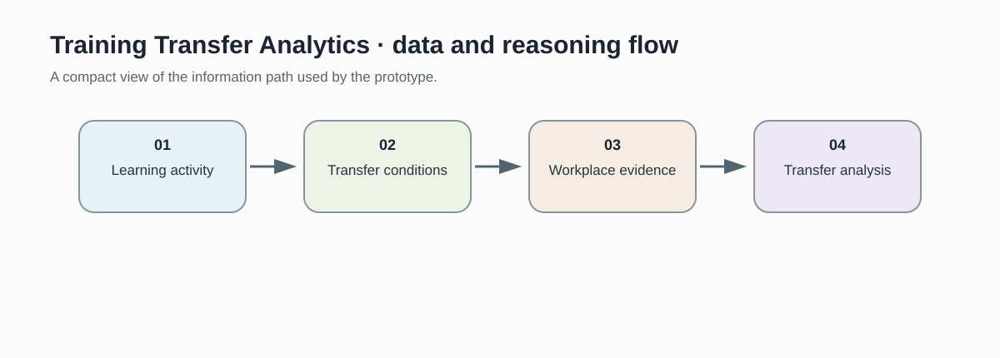
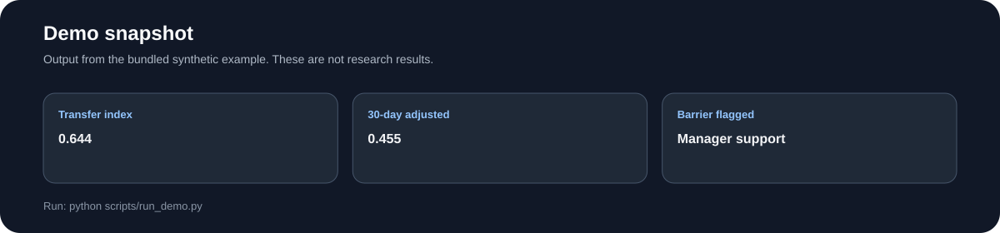
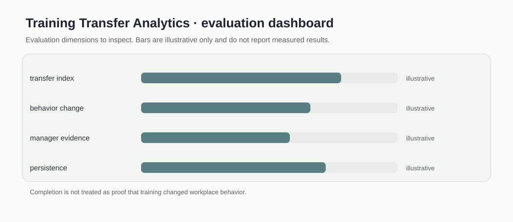

# Training Transfer Analytics

> Workplace transfer scoring baseline with evidence weighting, retention decay, and contextual barrier flags.

[](https://github.com/devissaputra/training-transfer-analytics/actions/workflows/ci.yml)



**Area:** Workplace Learning & Capability Development    
**Status:** working research prototype  
**Author:** Devis Wawan Saputra

## What this project is for

Course completion says little about whether new skills show up at work. This project combines learner, manager, and performance evidence into a transparent transfer index, then adjusts it over time and flags barriers such as weak manager support.

**Who may find it useful:** L&D researchers and practitioners studying whether training changes workplace behavior and performance.

## Research questions

1. Which post-training signals indicate transfer rather than course completion alone?
2. How does transfer change over time?
3. Where do manager support and opportunity-to-perform interact with transfer?

## How it works

The transfer index combines self rating, manager rating, and behavior evidence with fixed transparent weights, then scales the result by opportunity to perform. Separate functions apply an exponential half life adjustment and flag low manager support, opportunity, or tool access.



Learning evidence and workplace evidence are combined only after the transfer conditions are made explicit. The result is a review signal, not proof that training caused performance change.



This snapshot shows the bundled synthetic example for Training Transfer Analytics. It checks the software path; it is not an empirical performance result.

## Methods in the current baseline

- weighted transfer index
- self rating input
- manager rating input
- behavior evidence input
- retention decay and barrier flags

## Data

Synthetic training and post-training evidence are included.

`data/README.md` documents the sample schema and the conditions that should be recorded before any real dataset is connected. Restricted or identifiable learner data should stay outside the repository.

## Run the demo

```bash
git clone https://github.com/devissaputra/training-transfer-analytics.git
cd training-transfer-analytics
python scripts/run_demo.py
python -m unittest discover -s tests -v
```

The demo prints a synthetic transfer index, its 30 day retention adjusted value, and a manager support barrier flag.

## What to evaluate next

The next study should compare the index with observed workplace behavior over time and test whether the fixed weights are defensible. Training effects should be separated from opportunity, manager support, and other work conditions.

## Evaluation view



The Training Transfer Analytics dashboard is an evaluation checklist rather than a result chart. The bars are illustrative only; the labels show the evidence a real study would need to collect.

## Limits and responsible use

The index is a transparent scoring rule, not a validated transfer measure. Self and manager ratings can be biased, and decay should not be assumed without longitudinal evidence. See `docs/ethics_and_risks.md` for the broader risk review.

## Repository map

```text
.
├── .github/workflows/ci.yml
├── assets/
│   ├── architecture.svg
│   ├── data_flow.svg
│   ├── demo_snapshot.svg
│   └── evaluation_dashboard.svg
├── data/
│   ├── README.md
│   └── sample.csv
├── docs/
│   ├── ethics_and_risks.md
│   ├── related_work.md
│   └── research_protocol.md
├── reports/model_card.md
├── scripts/run_demo.py
├── src/training_transfer_analytics/core.py
├── tests/test_core.py
├── CITATION.cff
├── LICENSE
├── pyproject.toml
└── README.md
```

## Research path

A credible next version would:

1. collect repeated workplace evidence after a defined learning intervention
2. compare fixed weights with empirically estimated alternatives
3. test whether barrier flags explain low transfer better than completion data alone

## Related work

`docs/related_work.md` points to open projects that are relevant to this problem area. They are context for comparison and study design; this repository does not present their code as its own.

## Citation and license

`CITATION.cff` contains the software citation. The code and original SVG visuals use the MIT License. Any external dataset keeps its own license and usage conditions.
