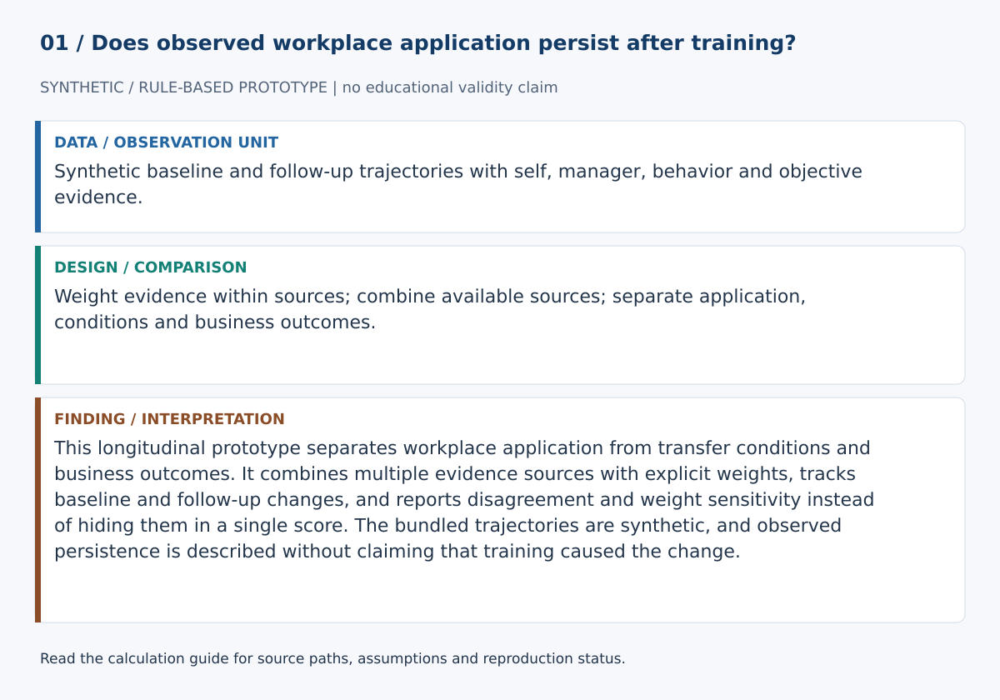
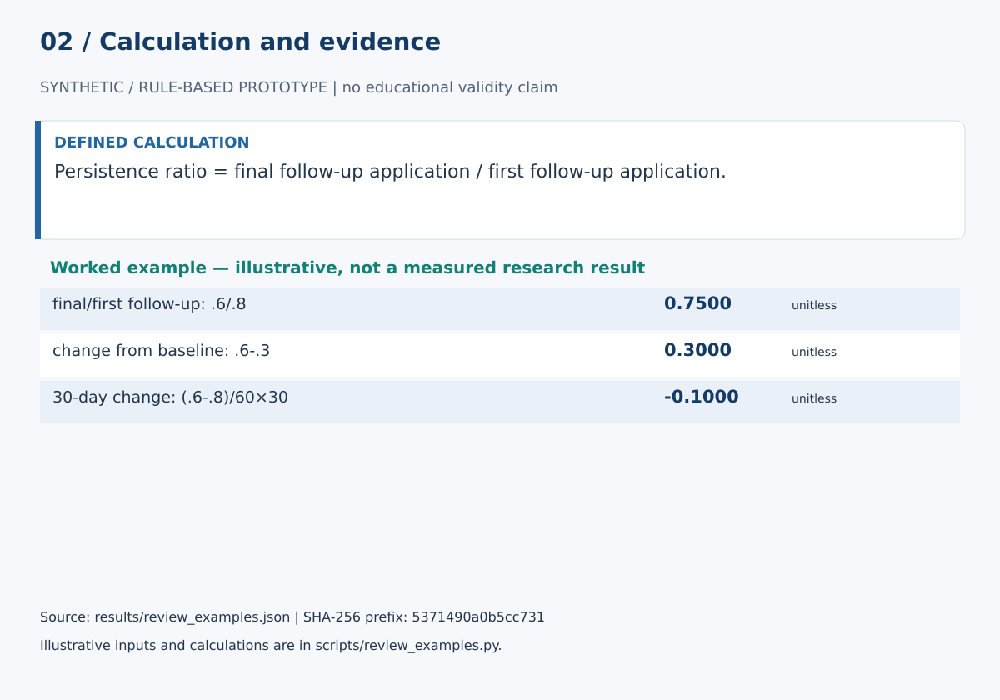

# Training Transfer Analytics

This longitudinal prototype separates workplace application from transfer conditions and business outcomes. It combines multiple evidence sources with explicit weights, tracks baseline and follow-up changes, and reports disagreement and weight sensitivity instead of hiding them in a single score. The bundled trajectories are synthetic, and observed persistence is described without claiming that training caused the change.

## Start here

- [Calculations, evidence and verification scope](CALCULATIONS.md)
- [Figure sources and exact numerical paths](docs/figure_spec.json)
- [Data status](data/README.md)

**Review scope:** 31 existing unittest checks passed. The bundled demonstration executed successfully in this review.

## Detailed project documentation

> Longitudinal workplace transfer analytics with multi-source evidence, observed persistence, transfer-condition diagnostics, and evidence-weight sensitivity.

**Area:** Learning & Development · Training Transfer · Workplace Capability  
**Status:** working research prototype  
**Author:** Devis Saputra

## Why this project exists

Course completion does not show whether a trained skill appears at work. A single post-training score is also not enough to show whether application persists.

Training Transfer Analytics provides a transparent baseline for examining workplace application before and after training, repeated 30/60/90-day follow-up, disagreement between evidence sources, persistence over time, transfer conditions, evidence-weight sensitivity, and business/performance outcomes kept separate from transfer.

The repository contains only synthetic data. It does not estimate the causal effect of training.

## Three concepts that stay separate

### Workplace application

The current baseline supports four evidence sources:

- self report
- manager observation
- behavior evidence
- objective workplace-application evidence

These can be combined into an inspectable application score.

### Transfer conditions

The system separately records:

- opportunity to perform
- manager support
- tool access
- peer support
- workflow support

These conditions do not multiply the application score. Someone can demonstrate strong transfer despite poor opportunity, while another person can show weak transfer under supportive conditions.

### Business/performance outcome

A role-relevant business or performance outcome can be stored separately. It does not enter the application score.

This allows the analysis to represent transfer improving while business performance stays flat, performance changing for unrelated reasons, or both moving together. None of those patterns is treated as causal evidence by the software.

## Longitudinal workflow

Each individual trajectory contains one pre-training baseline, one or more post-training follow-ups, multi-source workplace-application evidence, transfer-condition measures at follow-up, and an optional separate performance outcome.

The synthetic demo uses 30, 60, and 90 days.

## Multi-source evidence

Each evidence record contains a source, a value from 0 to 1, a confidence value from 0 to 1, and an optional instrument label.

Multiple records from one source are first confidence-weighted. Source-level values are then combined using explicit evidence weights. If a source is missing, the remaining available weights are renormalized.

The output also exposes source coverage, range across sources, standard deviation, and a disagreement flag so a composite cannot quietly hide major disagreement.

## Transfer conditions

The condition diagnostic reports original values, a review threshold, barrier labels, barrier severity, the minimum condition, and the mean condition.

The default threshold is a review heuristic, not a validated cutoff.

## Observed persistence

The old prototype automatically reduced a score with an exponential half-life formula. That is no longer the main analysis.

The current trajectory analysis calculates persistence from repeated observations:

- baseline application
- first follow-up application
- final follow-up application
- first and final change from baseline
- final divided by first follow-up persistence ratio
- change across the follow-up period
- change per 30 days when repeated observations exist

No decay curve is imposed on the observed trajectory.

## Hypothetical decay simulation

A half-life function remains available only as a simulation utility. It can answer what would happen under an assumed decay model, but it cannot answer how much transfer was actually retained.

## Evidence-weight sensitivity

The default evidence weights are self 0.15, manager 0.20, behavior 0.30, and objective 0.35.

These are transparent design assumptions, not empirically validated optimum weights.

Weight sensitivity can rerun the same trajectory under balanced, behavior-heavy, manager-heavy, or objective-heavy alternatives and report how final application and baseline change vary.

## Cohort analysis

The cohort summary reports the number of trajectories, mean baseline application, mean first follow-up application, mean final follow-up application, mean final baseline change, mean observed persistence ratio, mean separate performance-outcome change, and contextual barrier counts.

These are descriptive statistics, not treatment-effect estimates.

## Synthetic demo

The bundled data contain six synthetic cases:

- E01: strong transfer with supportive conditions
- E02: strong workplace application despite limited opportunity to perform
- E03: high early transfer followed by decline and weakening support conditions
- E04: substantial disagreement between evidence sources
- E05: maintained application despite weak tool access
- E06: workplace application improves while the synthetic business outcome remains flat

These cases exist to exercise the software path. They do not describe real employees.

## Data files

data/trajectories.json contains the complete synthetic longitudinal trajectories.

data/sample.csv is a compact tabular excerpt.

data/README.md documents schema, measurement boundaries, provenance, privacy, and real-data guidance.

## Run the project

Clone https://github.com/devissaputra/training_transfer_analytics.git, enter the training_transfer_analytics directory, then run:

    python scripts/run_demo.py
    python -m unittest discover -s tests -v

The current baseline uses only the Python standard library.

## Core API

- validate_evidence_weights: validates and normalizes source weights
- validate_evidence_records: validates workplace-application evidence
- aggregate_transfer_evidence: builds the application score and agreement diagnostics
- validate_conditions: validates transfer-condition measurements
- condition_diagnostics: returns contextual barriers without changing the application score
- validate_trajectory: validates one baseline and repeated follow-up structure
- analyze_trajectory: calculates baseline change, persistence, disagreement, conditions, and separate performance outcomes
- cohort_summary: aggregates descriptive transfer evidence across trajectories
- weight_sensitivity: tests alternative evidence-weight assumptions
- simulate_hypothetical_decay: runs an explicit decay simulation without pretending it was observed

## Evaluation plan

A credible study should separately examine evidence validity, source agreement, observed persistence, transfer conditions, performance separation, and whether the design can support any causal claim about training.

Completion, satisfaction, and post-training improvement alone are not proof of transfer or training causality.

## Research context

The repository is grounded in established training-transfer literature. Baldwin and Ford distinguish transfer in terms of generalization to the job and maintenance over time. Blume and colleagues meta-analyzed trainee, intervention, and work-environment predictors. Burke and Hutchins reviewed training transfer across HRD and related fields. Holton, Bates, and Ruona developed the Learning Transfer System Inventory for transfer-system factors.

See docs/related_work.md for references and the exact scope boundary.

## Responsible use

A low transfer score should not automatically be interpreted as low motivation or capability. The organization may have failed to provide opportunity, tools, manager support, peer support, or usable workflow conditions.

This prototype should not be used alone for hiring, promotion, termination, pay, discipline, forced ranking, performance ratings, psychological profiling, or covert monitoring.

See docs/ethics_and_risks.md.

## Limitations

The current baseline uses a hand-designed evidence composite, assumes supplied evidence values are already comparable on a 0–1 scale, does not validate assessment instruments, does not estimate rater reliability, uses a simplified transfer-condition representation, does not model attrition or informative missingness, does not produce statistical uncertainty intervals, does not adjust for concurrent organizational changes, does not estimate causal training effects, and does not implement validated LTSI scoring.

The output should be treated as a transparent research signal.

## Repository map

    .
    ├── .github/workflows/ci.yml
    ├── assets/
    │   ├── architecture.svg
    │   ├── data_flow.svg
    │   ├── demo_snapshot.svg
    │   └── evaluation_dashboard.svg
    ├── data/
    │   ├── README.md
    │   ├── sample.csv
    │   └── trajectories.json
    ├── docs/
    │   ├── ethics_and_risks.md
    │   ├── related_work.md
    │   └── research_protocol.md
    ├── reports/model_card.md
    ├── scripts/run_demo.py
    ├── src/training_transfer_analytics/
    │   ├── __init__.py
    │   └── core.py
    ├── tests/test_core.py
    ├── .gitignore
    ├── CITATION.cff
    ├── LICENSE
    ├── pyproject.toml
    ├── requirements.txt
    └── README.md

## Research path

A stronger empirical version would validate the workplace-application instruments, collect repeated evidence from multiple sources, estimate rater reliability where applicable, pre-register follow-up periods and missing-data rules, test weight sensitivity, use validated transfer-condition instruments where appropriate, model longitudinal uncertainty, compare transfer with separate business outcomes, and use an appropriate causal design when estimating training effects.

## Citation and license

CITATION.cff contains the software citation. Code and original SVG visuals use the MIT License. External datasets, instruments, and published frameworks retain their own licenses and usage conditions.
